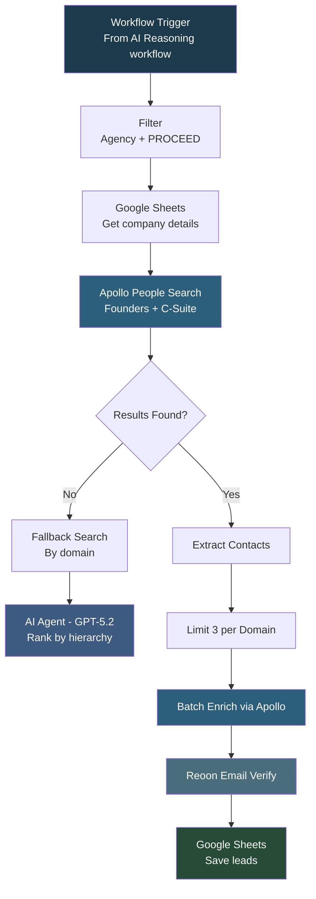

# HubCredo People Finder

## Overview

This is a **sub-workflow called by the HubCredo Outreach AI Reasoning workflow** to find decision-makers at qualified companies. It reads company data from the scored sheet, filters for companies marked as automation agencies with "PROCEED" recommendation, searches Apollo for founders and C-suite executives, uses AI to rank contacts by hierarchy, enriches them in bulk, verifies emails through Reoon, and saves qualified leads to a Google Sheet.

## How It Works

```
Triggered by Parent Workflow -> Filter Qualified Companies -> Apollo People Search -> AI Rank by Hierarchy -> Bulk Enrich -> Email Verify -> Save to Sheet
```

### Workflow Diagram



## Integrations

- **Apollo.io** - People search and bulk enrichment
- **OpenAI (GPT-5.2)** - Contact hierarchy ranking
- **Google Gemini** - Fallback AI for structured output
- **Reoon** - Bulk email verification
- **Google Sheets** - Lead output

## Setup

1. Import `Hubcredo_People_finder.json` into your n8n instance.
2. Update credentials for Apollo, OpenAI, Google Gemini, Reoon, and Google Sheets.
3. This workflow is designed to be called by the HubCredo Outreach AI Reasoning workflow.
